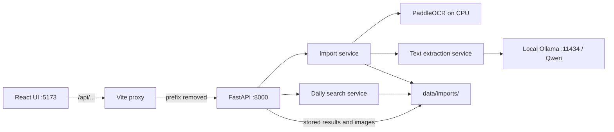

# Import Desk — WhatsApp Ticket Import

A local application for importing WhatsApp chat exports, extracting draft
ticket entries, reviewing their sources, and looking up complete matching
records across all saved imports for a selected business date.

**Imports are stored in local files, not a database.** Extracted tickets are
unvalidated drafts. A successful upload or search match does not mean a ticket
has been accepted or has won anything.

## Start the application

Use separate PowerShell terminals and keep both servers running. Backend
commands must run from the repository root so Python can import `main.py`.

### 1. Local model service

Ollama must be running at `http://localhost:11434` with the existing
`qwen3:4b-instruct` model. Check the installed models:

```powershell
Invoke-RestMethod http://localhost:11434/api/tags
```

If the Ollama desktop application is already running, do not start another
instance. If installed but stopped, run `ollama serve` in a separate terminal.
The configured model must appear in the tags response. Reopening and searching
completed imports do not invoke Ollama or OCR.

### 2. FastAPI backend — terminal A

```powershell
cd C:\Users\sabar\Desktop\Dev\Mani
.\paddle-env\Scripts\python.exe -m uvicorn main:app --host 127.0.0.1 --port 8000
```

Wait for `Application startup complete` and `Uvicorn running` before making
requests. Importing PaddleOCR can check model-host connectivity during startup;
model initialization happens on the first image request. Both can take time.

API documentation: **http://127.0.0.1:8000/docs**. The backend root `/` has no
webpage and returns 404; use the frontend URL for the application.

### 3. React frontend — terminal B

```powershell
cd C:\Users\sabar\Desktop\Dev\Mani\frontend
npm.cmd ci
npm.cmd run dev
```

Open **http://127.0.0.1:5173**. `npm.cmd ci` installs the locked dependencies;
subsequent starts need only `npm.cmd run dev`. Starting Vite does not start
FastAPI. `localhost` and `127.0.0.1` have separate browser storage, so use one
frontend origin consistently for the recent-import list.

The working local environment uses Python **3.12.10** and Node **26.8.1**.
Frontend versions are declared in `frontend/package.json` and locked in
`frontend/package-lock.json`. Installed backend versions at verification time:

| Package | Version |
| --- | --- |
| FastAPI | 0.143.0 |
| Uvicorn | 0.54.0 |
| python-multipart | 0.0.32 |
| PaddleOCR | 3.3.2 |
| paddlepaddle | 3.2.0 |
| ollama Python client | 0.6.3 |
| Pydantic | 2.14.0 |
| tzdata | 2026.5 |

This table describes the working environment, not a complete backend lockfile.
The repository relies on its existing `paddle-env`; copying a virtual
environment to another machine is not a reproducible installation procedure.

## Architecture and API wiring



`frontend/vite.config.ts` forwards `/api` to `http://127.0.0.1:8000`, removing
the prefix. Browser `/api/imports/...` becomes backend `/imports/...`.
Returned source image paths also use this proxy. No permissive CORS setting
is needed for this local configuration.

Frontend upload and Vite proxy timeouts are disabled because processing is
synchronous and can take several minutes. Individual Ollama calls have a
**300-second timeout** in `services/text_service.py`. The frontend never
automatically retries a POST: each POST creates another import, even if the
ZIP is identical.

## Import and review workflow

1. Export a WhatsApp conversation as a ZIP with exactly one chat `.txt` file
   and its available images. Select or drop the ZIP in the frontend.
2. FastAPI creates an import ID and records its timestamp and `business_date`
   in **Asia/Kolkata**. The API supports optional Party; upload UI omits it.
3. The import service validates/extracts the archive, parses message headers,
   and links referenced images to messages.
4. Text messages use local Qwen extraction. Images use PaddleOCR, then send
   OCR text regions and coordinates to Qwen for structured extraction.
5. Clear text extractions become `draft_unvalidated` records. Ambiguities,
   extraction errors, missing attachments, and all image-derived entries
   appear under Needs review. Unreferenced images also become review issues.
6. The service saves `result.json` and returns the report to the frontend.

Ticket numbers stay **strings** to preserve leading zeros. Duplicate entries
and their order remain intact. `count` is a ticket's quantity; “Draft ticket
entries” counts entries rather than summing quantities. Sender is source
metadata, not Party. Raw WhatsApp timestamps are displayed without guessing
DD/MM versus MM/DD.

Supported chat-header examples:

```text
09/10/2026, 10:00 - Sender: 001234-5
007890*2
[09/10/2026, 10:01:00] Sender: sample.jpg (file attached)
```

These illustrate the format; they are not saved application records. Plain
ticket lists without WhatsApp headers are not currently supported as chat
exports. Text before the first recognized header causes a format error.
The extraction prompt supports explicit number/count pairs separated by
`-`, `*`, `.`, or `,`, subject to ambiguity checks. Model extraction still
requires human validation.

Limits: **100 MiB ZIP upload**, **5,000 archive entries**, **500 MiB extracted
contents**. Images: `.jpg`, `.jpeg`, `.png`, `.webp`. Unsafe paths, symlinks,
encrypted entries, duplicate image filenames, and archives without exactly
one eligible chat text file are rejected.

## Daily ticket lookup

Click **Find a ticket** or **Ticket lookup**, select a business date, enter
the complete ticket number, and choose **Find records**.

- Searches every readable completed import saved for the day, including
  imports never opened in this browser.
- Uses exact string matching: `001234` does not match `1234` or `0012340`.
  Sender names and numbers appearing only in raw source text are not matches.
- Uses the saved **import business date**, not the WhatsApp message date.
- Returns every matching occurrence separately, including duplicates. The
  highlighted ticket is accompanied by its count, sender, original message,
  timestamp, import ID, available Party, and original status.
- Complete saved-record JSON includes sibling tickets and available OCR/model
  details. Open the full import or enlarge a retained image from the record.
- Structured ticket suggestions in review issues are searchable but remain
  labelled **Needs review — unverified suggestion**. OCR text alone is not
  treated as an extracted ticket list.
- Failed/in-progress imports without `result.json` cannot be searched.
  Unreadable/malformed result files trigger a visible incomplete-search warning.
- Lookup is read-only and changes no validation or acceptance status. It scans
  saved files; large collections may need database indexing later. The API
  returns all matches; the UI displays 20 per page.

## API reference

| Method | Backend route | Purpose |
| --- | --- | --- |
| POST | `/imports` | Multipart `file` required, `party` optional. Synchronous processing; returns 201 with the saved report. |
| GET | `/imports/{import_id}` | Returns a completed report. |
| GET | `/imports/{import_id}/issues` | Returns `{import_id, issues}` from the report. |
| GET | `/imports/{import_id}/images/{filename}` | Serves a retained image using its generated filename. |
| GET | `/tickets/search?business_date=YYYY-MM-DD&ticket_number=001234` | Returns exact matches for the selected business date. |

Prefix these routes with `/api` when calling through Vite. Import IDs are
32 lowercase hexadecimal characters. Missing/unfinished results return 404;
invalid request fields return 422; rejected uploads can return 400 or 413;
unexpected processing failures return 500. Unavailable search storage returns
503. The frontend renders FastAPI string, object, and validation-array errors.

Search responses contain `business_date`, `ticket_number`, `match_count`,
`matched_import_count`, `searched_import_count`, `matches`, and `warnings`.
Each match contains `ticket`, complete original `record`, `record_type`,
`record_index`, `ticket_index`, and import identity/date/status metadata.
Frontend types and parsing live in `frontend/src/api.ts`.

## Storage and project layout

```text
main.py                         FastAPI endpoints and request logging
logging_config.py               Application log configuration and timings
services/
  import_service.py             ZIP validation, parsing, extraction orchestration
  text_service.py               Ollama prompt and Pydantic output checks
  ocr_service.py                Cached PaddleOCR model and serialized inference
  search_service.py             Exact daily lookup across stored results
data/imports/<import_id>/
  metadata.json                 Import timestamp, business date, Party
  source.zip                    Uploaded archive
  chat.txt                      Extracted conversation, when available
  media/<generated-name>        Retained source images
  result.json                   Completed report, when processing succeeds
  error.json                    Certain validation/format errors
frontend/
  src/App.tsx                   Workspace navigation and import/reopen state
  src/api.ts                    API types, requests and response/error handling
  src/history.ts                Browser-only import summaries
  src/components/               Upload, results, sources, preview and daily lookup
  src/styles.css                Responsive theme and focus styles
  vite.config.ts                Frontend server and API proxy
  tests/                        Live browser checks and labelled test ZIPs
tests/
  test_ticket_search.py        Isolated search-service and API tests
  test_text.py                 Manual Qwen smoke check; prints extracted data
  test_ocr.py                  Manual PaddleOCR smoke check using sample.jpg
```

Reports contain metadata, `drafts`, `issues`, message/image counts, and
`accepted_ticket_count` (currently zero). Failed uploads may leave metadata
and source files behind; automatic cleanup is not implemented. Back up the
whole `data/imports` tree to retain results and original sources.

The browser's “Imports opened in this browser” list stores up to 20 IDs and
summary counts in localStorage. Clearing it does not remove backend files.
Open by import ID or use daily lookup to retrieve saved data independently.

`DeepSeek-OCR-2/` exists locally but is not used by the active services.
`sample.jpg` and `output/` are development/sample artifacts.

## Troubleshooting connections and processing

Check each connection independently:

```powershell
# Direct backend: should return the OpenAPI document.
Invoke-RestMethod http://127.0.0.1:8000/openapi.json

# Frontend proxy: should expose the same routes.
Invoke-RestMethod http://127.0.0.1:5173/api/openapi.json

# Read-only lookup: a 200 response may legitimately contain zero matches.
Invoke-RestMethod 'http://127.0.0.1:5173/api/tickets/search?business_date=2026-10-09&ticket_number=001234'
```

| Symptom | Meaning and next step |
| --- | --- |
| HTTP 502 / connection refused | The proxy cannot reach FastAPI. Check terminal A, port 8000, and startup completion. Vite alone does not start the backend. |
| Direct API works, `/api` fails | Check Vite on port 5173 and its proxy config. Restart Vite after changing configuration. |
| HTTP 400, “Unrecognised chat header” | The request reached FastAPI, but the text format is unsupported. Use a WhatsApp export with message headers. This is not a connection error. |
| Backend `/` returns 404 | Expected: the UI runs on 5173; backend documentation is `/docs`. |
| Reopening an import returns 404 | Check its ID and completed `result.json`. Failed or still-processing imports may not have a result. |
| Upload takes several minutes | OCR/model work is synchronous. Watch backend logs rather than repeatedly submitting the ZIP. |
| Upload connection interrupted | Processing may still be running. Check logs before resubmitting. Reopen by ID when known. No progress/cancellation endpoint exists. |
| Extraction becomes a review issue | Verify Ollama and the model name, then inspect error details/logs. Ambiguous or invalid model output is not automatically accepted. |
| Search has no matches | Check business date, exact digits/leading zeros, and import completion. Raw-text occurrences alone are not searchable ticket records. |
| Incomplete-search warning | Inspect reported import IDs and logs. Some result files could not be read or validated. |
| Recent-import list is empty | Check the frontend origin and browser storage. Use the ID input or daily lookup. |

## Logging and checks

Application logs go to stderr with timestamp, severity, duration, and request
ID. `X-Request-ID` is returned by the request middleware. Set
`$env:LOG_LEVEL = "DEBUG"` before starting the backend for more detail.
Application logs exclude source contents and exception payloads. Uvicorn and
third-party logs are separate; Uvicorn access logs can include search query
strings. See [LOGGING.md](LOGGING.md).

Backend search tests use temporary fixture storage and no model calls:

```powershell
.\paddle-env\Scripts\python.exe -m unittest discover -s tests -v
```

Run the manual model checks explicitly from the repository root:

```powershell
.\paddle-env\Scripts\python.exe -m tests.test_text
.\paddle-env\Scripts\python.exe -m tests.test_ocr
```

These commands invoke the real models and print their results. They do not
run during automated test discovery. The OCR script uses `sample.jpg` in the
repository root; the text script requires the configured local Ollama model.

Frontend verification:

```powershell
cd frontend
npm.cmd run typecheck
npm.cmd run build
npm.cmd run test:e2e
```

Playwright uses installed Microsoft Edge by default and requires the real
backend. Import checks create labelled test imports in `data/imports/` that
remain on disk. Set `TEST_TEXT_IMPORT_ID` and `TEST_IMAGE_IMPORT_ID` to previous
verification fixture IDs to reuse model results. Browser checks cover upload,
reopening, source inspection, image previews, errors, daily lookup, mobile
layout and accessibility. See [frontend/README.md](frontend/README.md).

Run `npm.cmd run preview` after building to inspect the production bundle at
**http://127.0.0.1:4173**. Preview also proxies `/api`. Other static hosts need
their own `/api` reverse proxy; the generated `dist/` contains no backend.

## Current boundaries

No database, automatic acceptance, winning rules, manual ticket submission,
saved review corrections, daily Excel generation, authentication, or cloud
LLM calls are implemented. Servers are configured for local use. OCR scores
and model suggestions do not guarantee correct digits.
